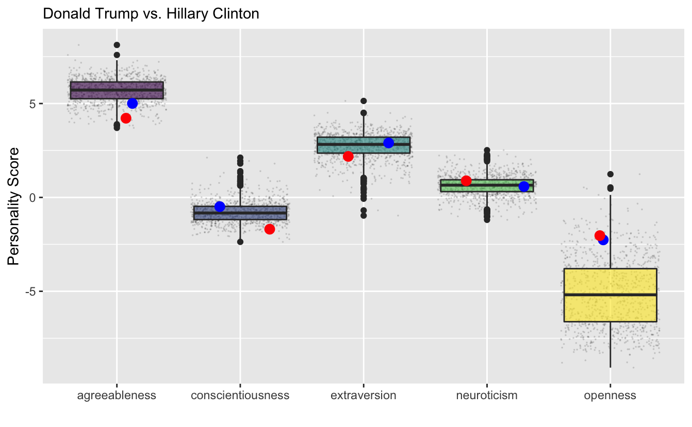
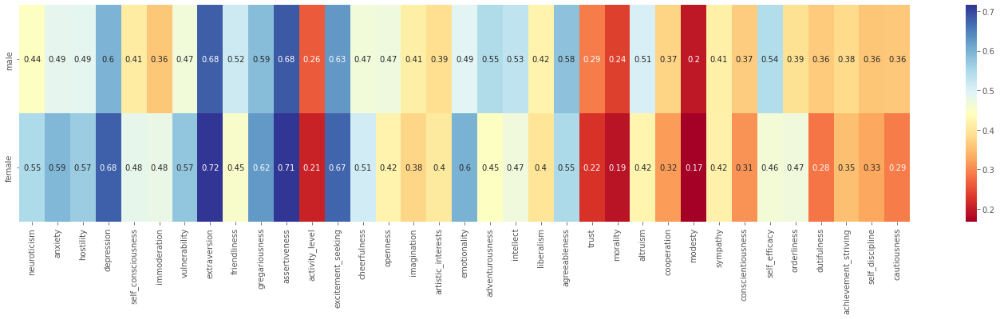
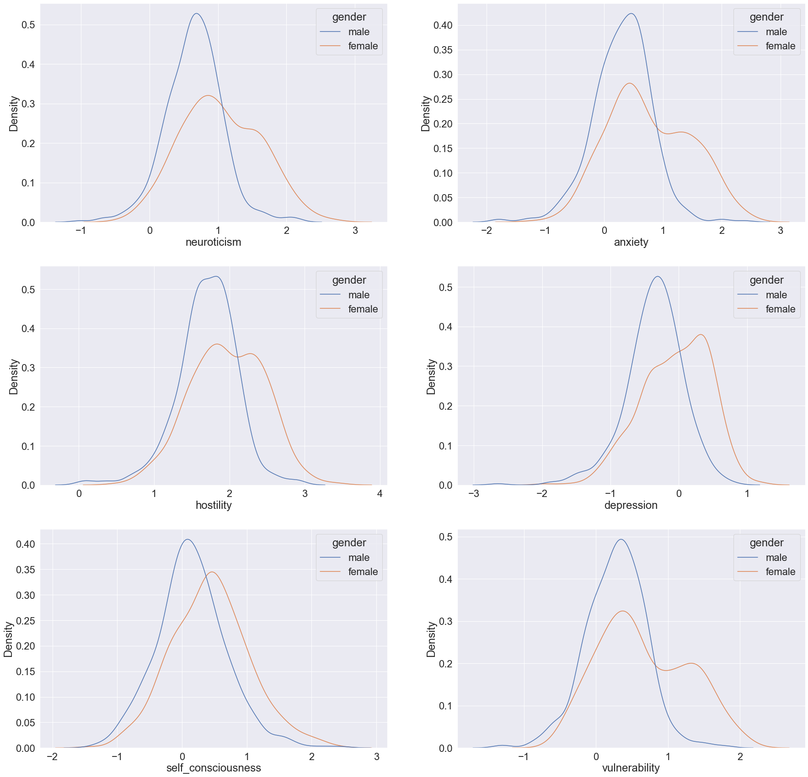
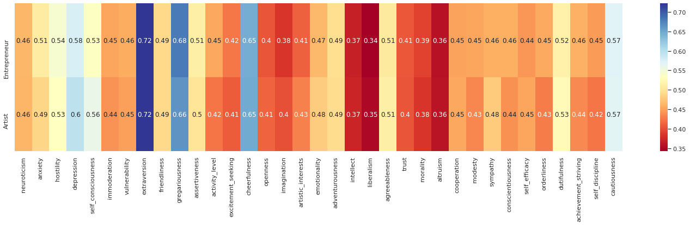
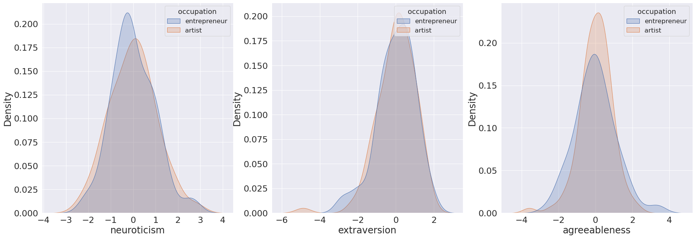
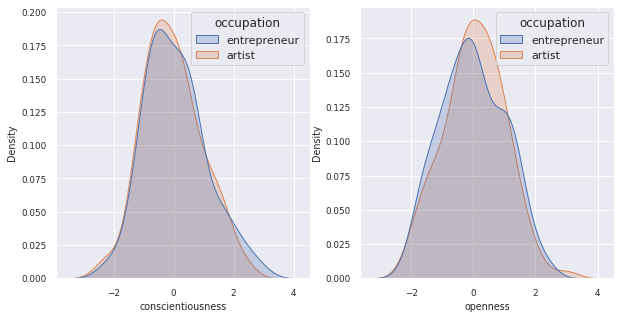

## Some interesting personality quote 

### Introduction

Language is the main mode of communication through which a person expresses their thoughts and feelings. We tend to form an opinion of a person after just a few interactions with them either through spoken or written conversation. This then raises an interesting question: Do language use truly reflect personality types? While the idea that language and personality are related is not new [1], systematic examination of how word use relates to individual differences in personality traits have only been studied by researchers in the recent past [2][3]. Inspired by these studies, in this article, we aim to explore and analyze this relationship using Quotebank, an open corpus of 178 million quotations attributed to the speakers who uttered them, extracted from 162 million English news articles published between 2008 and 2020. [4]

#### From Text to Personality Score
Before delving into various analysis on personalities, we would like to give you a background on the core ideas and methods enabling our study. We are given a corpus of text for each speaker and somehow, we would like to transform this text to a number so that we can quantify the personality of a speaker and do all kinds of comparisons. How do you go from a piece of text to a personality measure you ask? Good question! We asked the same question and luckily, we were not the first people to have thought about it! There have been several studies on this topic in the past that have shown significant correlations between different word categories (e.g. pronouns, positive/negative words etc.) and personality types. Most of these studies focus on finding the relationship between personality types and so-called LIWC word categories[5] using supervised learning methods. After an extensive examination of these psycho-linguistic study papers, we decided to use the correlation results found between the Big Five personality types[6] and LIWC word categories, from a large-scale study of personality and word use among bloggers[7]. 

More concretely, given a sample corpus of text for a sample of speakers, we first run this text through the commercial LIWC software[8] (seriously, we bought it!) to produce a matrix of frequency numbers (let's call it L) where rows correspond to a speaker and columns are the different word categories. On the other hand, we have a matrix of correlations (let's call it C) between the very same word categories and all the Big Five personality types and subtypes (extracted from [7]). We then simply multiply these matrices (we also first normalize L across word categories) to produce our personality scores (let's call it P). Mathematically speaking, P = LC where the rows of P correspond to different speakers and columns are the different facets of Big Five personality traits (e.g. depression, trust, dutifulness etc.) Voila! We started with a piece of text and ended up with a bunch of numbers presumably corresponding to personalities of people. In the rest of the article, we will try to analyze these numbers for people across professions, idealogies, countries, genders etc. to see whether these correlations hold and reveal the real world of personalities.

### Some funny title for politicians analysis

Let's compare some politicians!
<iframe height="700" width="1000" frameborder="no" src="https://yirencao.shinyapps.io/polis/"> </iframe>

#### Validation for Politician Analysis

The score of the 1000 people's control group is used to generate the boxplots above, the actual data points are also plotted in black. While the counterparts for Donald Trump and Hillary Clinton are plotted in red and blue respectively.

According to the [paper `Perceived personality and campaign style of Hillary Clinton and Donald Trump`](https://www.sciencedirect.com/science/article/pii/S0191886917305688?casa_token=1aBX0HMkSQ0AAAAA:I4CHEpEfM9LRiQCrsLw1lk61IUt0MJu2RvD8L7t_PV_xBHisPnM8Z78xrEyfTpqa1Xo7ollgvM7L) where the big five personality score of Trump and Clinton are evaluated by domain experts as below. 
Clinton scores low on neuroticism, average on agreeableness, extraversion, openness, and high on conscientiousness.
Trump scores very low on agreeableness, conscientiousness and emotional stability, average on openness, and very high on extraversion.
Our results agree to the research in agreeableness and conscientiousness but contradicts in extraversion, neuroticism and openness. 
However, the personality rating is to some extent subjective. Even for the experts in this specific case, Trump supporters and Clinton supporters will rate significantly differently, as depicted in [a later finding](https://www.sciencedirect.com/science/article/pii/S0191886918300850).

#### Can we cluster similar politicians together?
To cluster the politicians in terms of their personality, we first perform PCA to reduce the dimension of our dataset since we have 35 variables for personality traits. Then based on PC1 and PC2, the major two dimensions that explain most of the variations, we produce k-means clustering. We choose k = 2 as the optimal one by looking at the total WSS and silhouette plots.

<iframe height="750" width="100%" frameborder="no" src="html/pca_politician_k_2.html"></iframe>

K-means clustering gives us two groups and we rename the two groups as `Cheerful Gregarious` and `Intellectual Liberals` based on the interpretation of PCA. 

### Women are more neurotic and men are more conscientious
If you are still wondering why we haven't applied our algorithm on a typical gender analysis, wonder no more! Of course we did and we got some interesting results. We selected quotes for top 1000 men and women speakers (500 each) and analyzed the personality scores between them. Let's first look at a heatmap of correlations to get a sense:

We can see unsurprisingly that men and women differ on most dimensions. But how significant are these results? Let's check the underlying distributions. Let's first check the neuroticism:

These graphs (and the accompanying significance tests) clearly show that women tend to be more neurotic than men. These results are actually not so surprising if we take a look at the literature on the gender differences in personality such as [9]. Previous findings have in fact shown that women are known to report higher scores on Neuroticism and almost all of its subtypes. 
Similarly we find that men are more conscientious:

#### Can personality alone predict your gender?
If there are stark differences in personalities across genders, could they be a good predictor of a gender? Maybe. We ran a simple logistic regression model using solely the personality attributes to predict the gender of a person and it achieved a cross-validated 76% accuracy. And guess what were the best predictors among all the personality traits? You guessed it right! Neuroticism and conscientiousness.

### Some funny title for suicide analysis

### Some funny title for entrepreneur/artist analysis
Bill Gates/Murray ?
Entrepreneur or Artist ?

If someone ask you to describe the personaity traits of an entrepreneur, what would you say?
Most people would describe a driven, extraverted, energetic, action-oriented person. 
However, they might not describe the same for an artist. What do you think? Are entrepreneurs and artists quite similar to each other in their personality traits or are they different?
There have been several studies comparing the personality traits of entrepreneurs and artists [10].
Surprisingly enough, most of these researches show that both entrepreneurs and artists are quite similar to each other in their personality traits. Let's see what quotebank data has to say about our question.

We selected quotes of top 100 entrepreneurs and artists and analysed the personality between them. Guess who is the top entrepreneur speaker ? You are right if you guessed Trump! Who can ever beat him? (Biden obviously XD)

From the above heatmap, we can see that both entrepreneurs and artists are quite similar in many personality types. To truly understand the similarity we compared the distribution of the personality scores for the big five personality types i.e, neuroticism, extraversion, agreeableness, conscientiousness, openness. 

We can see that even the distributions are quite similar to each other. However, to put a cherry on the top we did hypothesis testing on the similarity of the big five personality score values of artists and entrepreneurs. 
The signifince test shows that the personality values for artists and entrepreneurs are similar.

The research also shows that Artists score higher in emotionality and agreeableness at the same time entrepreneurs score higher in self-efficasy and extraversion. Our analysis agrees with the research in emotionality value. However, the personality values are same for both entrepreneurs and artist for the other three personality traits. To check the significance of these values, we did hypothesis testing on them. T test on theses values show that the difference is not significant. Which means that there is no significant difference in personality of artists and entrepreneurs.

### Does world have a personality?
I think by now you see where we are going with this, don't you? As a closing analysis, we are going to take this idea even further and attempt to see if we can come up with a personality score for each country and compare those through time. Our speakers in the Quotebank dataset have the associated nationality attribute taken from Wikipedia and we will use these to identify top speakers for each country. These people will be the representative for their respective countries and we will assume their averaged personality scores reflect their country's hypothetical personality (Of course this is somewhat naive assumption, but if you think about it, top speakers are most likely the politicians and other famous celebrities who are typically the face of their countries). First let's visualize how well each country is represented in the media by their number of speakers:
<iframe height="500" width="100%" frameborder="no" src="html/world-speakers.html"> </iframe>
We immediately see that the US dominates the media with more than 400k speakers and Africa, Middle East and Middle Asia are some of the least represented regions. In Europe, somewhat surprisingly Germany and France seem to be dominating the media with number of mentioned speakers twice that of UK.

With this simple analysis out of the way, we will choose 100 most quoted people from each country per year and compute average of their personality scores to obtain a single personality score for each one of the Big Five traits per year per country. We then visualize all of these graphs in one interactive graph where you can choose a specific personality trait and also slide through time.

<select class="personality-selector"></select>
<iframe class="personality-frame" height="500" width="100%" frameborder="no" src="html/world-map-depression.html"> </iframe>

### Conclusion

### Team, Links to repo

### References
[1] Sanford, 1942
[2] Fast and Funder, 2008
[3] Mehl et al., 2006
[4] Quotebank
[5] LIWC Category
[6] https://en.wikipedia.org/wiki/Big_Five_personality_traits
[7] Personality in 100000 paper
[8] LIWC software
[9] Gender difference paper
[10] https://link.springer.com/article/10.1007/s11187-020-00420-1